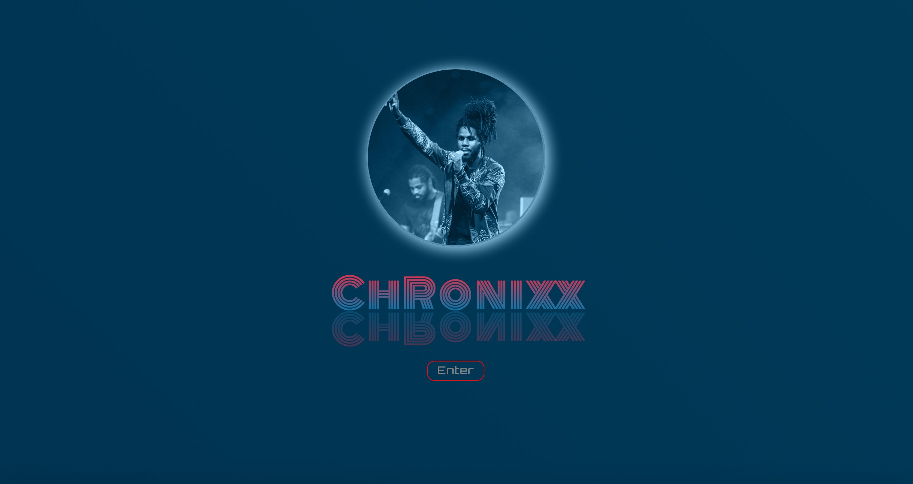
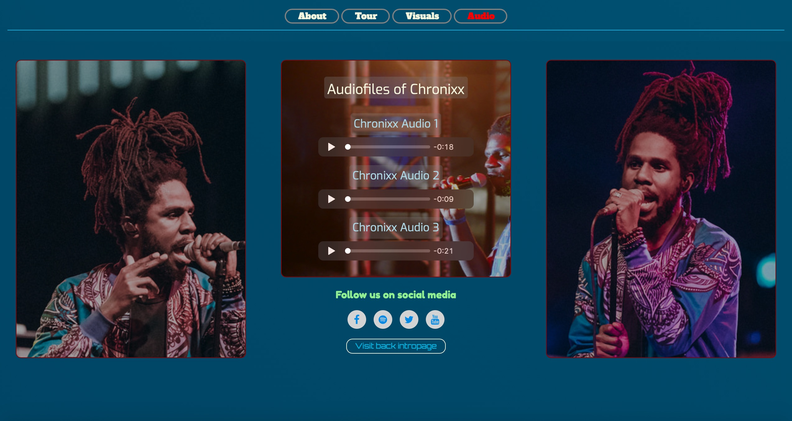
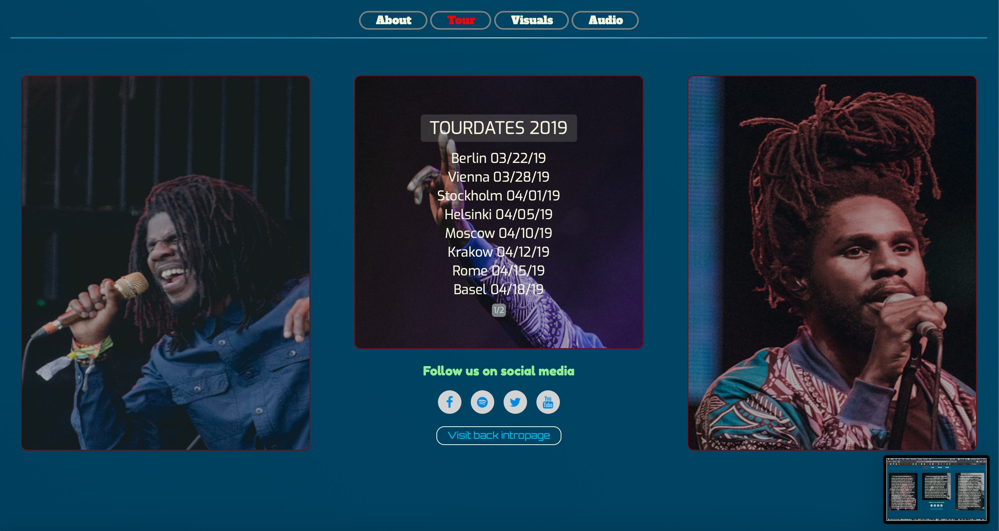
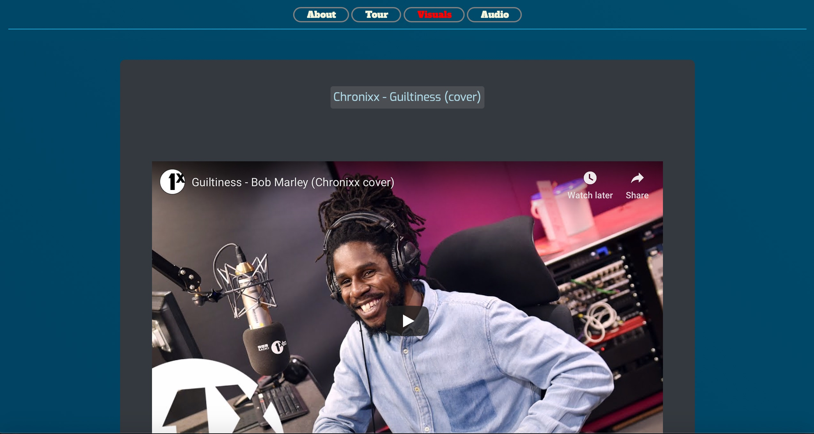

<h1> User-Centric-Frontend-Development Milestoneproject: Introduction of Chronixx music </h1>

This project is about introduction of an artist, named Chronixx, to inform with background information, as well as upcoming tourdates, current songs from youtube and offering audiomaterial.
It is a demonstration of different techniques of HTML and CSS I have tried in my labtime so far and combines them all together in this project.

<h1> Screenshots </h1>

<h1> UX </h1>

The goal was to create a small web presence of 4 to 5 pages to inform the target group about historical information of this act, provide the user with upcoming tourdates and show off some visual and aural content of the musician’s performance.

As a user, I want to be able to retrieve information of the artist to learn and get a glimpse about the talent.

<em><b> Please note, the related wireframes diagrams are located in the folder /assets/sketches/ of this repository. </b></em>

<h1> Technologies used  </h1>

As per course objective, I used HTML 5.0 as well as CSS 3.0. This User-Centric-Frontend-Development milestone project is based on Bootstrap framework v. 3.3.7.

<h1> Features </h1>

So to meet the requirements of producing 4 to 5 pages, I created pages accordingly, such as:
 
  An intro page with Chronixx’s portrait,
  an about page providing historical background information,
  a page informing about touring events across Europe,
  a page showing off two tracks found on youtube platform and last but not least
  a page to offer audio content.

The goal was to come up with an implementation of various CSS 3.0 features. This site is mainly for informing (displaying content) to the user.

<h1> Features Left to Implement </h1>

A future version of this site might feature an additional form to get in contact with the booking agency
A news section to inform about the latest news about this act.

<h1> Technical details of related HTML files </h1>

As external resources I have used Font Awesome (ver. 4.7.0) and google fonts such as  “Alfa Slab One”, “Exo”, “Fredoka One”, “Monoton” and “Orbitron”.

<h2> INDEX.HTML </h2>

Despite of using Bootstrap’s responsive system, the index.html is the only page inside this project which is on all three breakpoints displayed exactly the same way. The presentation is not altered.

The body features an animated background consisting of a gradient. The moving aspect  is achieved by animating the background-position property.
The portrait of the artist has been implemented with two different blend modes (mix-blend-mode and background-blend-mode).

The Chronixx banner consists of multiple div’s (which contain each 2 div’s), all set to ‘display: absolute’ so they line up all after themselves. The letters are then set to opacity: 0; and are animated to spread out by translateX() property.

A mirror effect is realised by simply turning a copy of a letter around the x-axe by rotateX(180deg). Afterwards the opacity is reduced to get the mirror effect.

The point of action to the user is marked by red pulsing frame of the enter button. Hovering over the enter button results in red color transition.  

<h2> ABOUT.HTML </h2>

The navigation bar on top of the screen remains fixed at all times. The currently visited site is marked with red letters and transitions to red when hovering the mouse on link.
The header is optically separated from content section by a laser like beam which works exactly as the animated body background on index.html.

The about text on mobile version is displayed in one column. The desktop version has two additional text columns. A background image is placed inside the div. A second layer is placed between text and background to make it easier to read the text.

The footer is accessible on all four pages and carries the links to official pages social media, as well as a link to visit back the intro page.

<h2> TOUR.HTML </h2>

Mobile version has only one column, the desktop version features three columns.
The middle section displays the touring details. The related container carries two div’s which are on same position, each div contains one page of dates. Both div’s are animated in its opacity. When one div’s opacity is 1 the opacity of the other is set to zero. Also some blurring effect is applied just before the fade taking place.    

<h2> VISUALS.HTML </h2>

Two tracks of Chronixx on youtube platform are displayed and playable. Both iframes spread across the whole screen on desktop breakpoint.

<h2> AUDIO.HTML </h2>

Three audio files have been implemented to play on this page. Those files are merely for demonstration.

<h1> Testing and quality checks </h1>

<b> Additional tools have been used to complete quality check tasks: </b>

Github autoprefixer to update browser vendor prefixes :white_check_mark:  
Reviewed proper function on several browser systems and devices:  
Tested three different breakpoints :white_check_mark:  
Separated bootstrap code from own code :white_check_mark:  
Applied housekeeping :white_check_mark:  
Final code was checked by W3 CSS and HTML validators :white_check_mark:  

Testing of functionality was done under latest versions of OS and browsers as follows:

<b> Ipad Air 2 on Safari </b>:white_check_mark:  
<b> Iphone 8 Plus on Safari and Firefox </b>:white_check_mark:  
<b> Mac on Safari and Firefox </b>:white_check_mark:  

Unfortunately I could not manage to test on Android devices and Windows OS as a lack of devices to test with. I clearly understand that this is a must for future projects to ensure proper usability on all targeted devices. Google Chrome needs to be added as well.

<em><b> Please find the reports of W3 validators and screenshots of device testing in folder /QC. </b></em>

<b> CHECKLIST OF GUIDELINES AND REQUIREMENTS: </b>

4 or 5 static pages :white_check_mark:  
Using grid system from Bootstrap :white_check_mark:  
Providing a responsive website :white_check_mark:  
Use of semantic elements :white_check_mark:  
Planning of UI with wireframing :white_check_mark:  
Links to artist’s social media :white_check_mark:  
Creation of README.md :white_check_mark:  
Deploy each functionality in separate git commit :white_check_mark:  
Check by W3 CSS and HTML validators :white_check_mark:  

<h1> Deployment </h1>

After testing new code, the deployment was done first locally and then to github. Each functionality in one commit (mostly). Github pages is the only hosting service used so far.

This project can be cloned locally by using the command

<em><b> git clone https://github.com/poldi2018/Milestone1-User-centric-frontend </b></em>

<h1> Credits </h1> 

<h2>Content</h2>
The text for the about texts as well as the links to social media were taken from artist’s official site.

<h2>Media</h2>
The photos used in this site were obtained from google advanced image search which were marked as re-usable.  

<h2>Acknowledgements</h2>
Various sites for demonstration on CSS functionality were consulted for inspiration. No code has been copied from other creators, everything was conceived by myself. 

